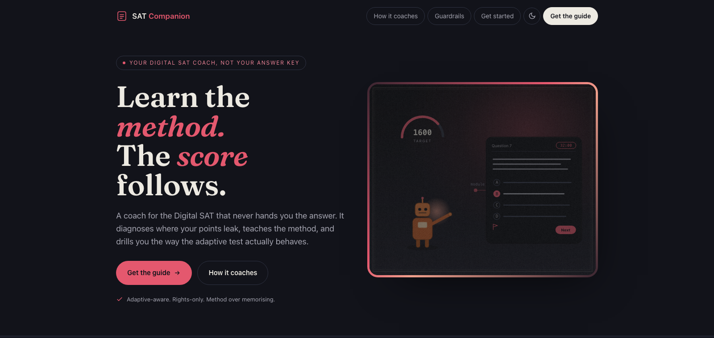

# SAT Companion

  

  <strong><a href="https://grahamlittle.github.io/sat-companion/">▶ View the live page</a></strong>

A coach for the **Digital SAT**. It never hands you the answer: it diagnoses where your points leak, teaches the method, and drills you the way the adaptive test actually behaves — so you earn the score yourself.

It is grounded in the real test: the section-adaptive two-module design, the content domains, rights-only scoring, and the Bluebook tools (including the built-in Desmos calculator). It targets the one or two things costing you the most points, instead of vague "practice more" advice.

> **New to AI tools? Start here.** You do not need to be technical. Pick the setup path below that matches the app you already use. The claude.ai path takes about five minutes and needs no installation.

---

## What it does

- Coaches both sections — **Reading & Writing** and **Math** — by content domain, for the current Digital SAT.
- **Diagnoses where your points leak** (a domain, a question type, timing, or careless slips) and targets it.
- Teaches **transferable methods**, not one-off answers — because every test form is unique.
- Knows the **adaptive design**: Module 1 sets the ceiling, so early accuracy and pacing are high-leverage.
- Builds **test-craft**: Desmos fluency, per-question pacing, flag-and-return, and always-guess (scoring is **rights-only**, no penalty for wrong answers).
- **Coaches in your language, practises in English.** It can explain a concept in your first language, but every passage, answer choice, and worked example stays in English — because that is what the exam tests.
- **Refuses** to hand you the answer letter or an answer key to memorise. It develops you so you earn the score yourself.

---

## Which setup do I use?

| You use… | Go to | Difficulty |
|----------|-------|------------|
| **claude.ai** in a web browser | [`claude-project/`](claude-project/) | Easiest — 5 min, no install |
| **Claude Code** (CLI or desktop app) | [`skill/`](skill/) | Drop-in folder |
| **ChatGPT, Gemini, or another AI** | [`generic/`](generic/) | Copy-paste one prompt |

Each folder has its own `SETUP.md` with step-by-step instructions. If you are unsure which you have: if you talk to the AI in a normal website tab, you are on **claude.ai** — use the first row.

> **A note on language quality.** SAT Companion always produces practice content in English, but it can *explain* in your first language. How good those explanations are depends on the AI model you run it on, not on this prompt. Strong general-purpose models (such as Claude) explain well across many languages; smaller or older models can be weaker outside English.

---

## Landing page

A ready-made landing page lives in [`docs/`](docs/): [`docs/index.html`](docs/index.html), with matching HTML setup guides beside it (`docs/setup-claude.html`, `setup-code.html`, `setup-generic.html`) and a shared stylesheet + fonts in `docs/assets/`. The whole `docs/` folder is a static mini-site — no build step, no dependencies.

**To publish it with GitHub Pages:** push this repo, then go to **Settings → Pages**, set **Source: Deploy from a branch**, **Branch: `main`**, **Folder: `/docs`**, and Save. Your live page appears at `https://<your-username>.github.io/sat-companion/` within a minute or two.

To preview locally, open `docs/index.html` in a browser; its "Get started" buttons lead to the HTML guides, which link to the actual files to copy.

---

## How to use it (the workflow)

SAT Companion is built around one idea: **it asks for your attempt before it explains.** Do not treat it like an answer key. Treat it like a coach sitting next to you.

A good session looks like this:

1. **Say who you are.** "Digital SAT in five weeks, diagnostic 1180, target 1350, weakest in Math." It needs your timeline, current/target score, and pain point to help properly.
2. **Bring a question you got wrong — and your reasoning.** The wrong choice reveals the misconception. It diagnoses *that*, not just the right answer.
3. **Answer its questions.** It will ask you things before explaining. That is the point — the reasoning is how you learn.
4. **Learn the method.** Ask "what's the transferable approach here?" It ties the fix to the content domain and to real test-craft (Desmos, pacing, guessing).
5. **Do the next drill.** It closes each reply with a question or a practice item. Do it — that is where the improvement locks in.

**What it will not do:** give you the answer letter to move on, or hand you answer keys to memorise. If you ask, it declines and redirects to working the reasoning together. This is deliberate: memorising answers does nothing for an adaptive test where every form is unique.

### Example opening messages

- *"Digital SAT Math. Here's a linear-systems question I got wrong and the answer I picked — help me find my mistake, don't just tell me the answer."*
- *"Reading & Writing — I keep choosing the tempting wrong option on Inference questions. What am I doing wrong?"*
- *"I run out of time in Math Module 2. How should I be pacing?"*
- *"Show me how to use Desmos to solve quadratics faster on the test."*
- *"Explícame en español, pero mantén las preguntas de práctica en inglés."* (Explain in Spanish, but keep the practice questions in English — any language works for the coaching.)

See [`examples/first-session.md`](examples/first-session.md) for a full worked conversation.

---

## For people brand new to AI assistants

If you have never set up a custom AI before, two concepts help:

- **A system prompt / instructions** is a block of text that tells the AI *who to be* — here, a Digital SAT coach with rules. You paste it once and it holds for the whole conversation.
- **Knowledge / reference files** are documents the AI can look things up in — here, the test structure, the Reading & Writing and Math detail, and the scoring and strategy.

The [`examples/`](examples/) folder also includes a plain-English `CLAUDE.md`/`AGENTS.md` that explains, in beginner terms, what a "context file" is and how these AI setups work.

---

## Academic integrity

This tool exists to make you a stronger test-taker, not to hand you answers. It will not give you answer keys or do the thinking for you. Use it the way you would use a good coach: to be questioned, corrected, and stretched. Your score on test day must be your own.

---

## Credit & licence

Created by **Graham Little**. Built on the current Digital SAT format and scoring as published by the College Board.

SAT Companion is an independent study aid. It is **not** affiliated with, endorsed by, or produced by the College Board. "SAT" and "College Board" are trademarks registered by the College Board. "Bluebook" and "Desmos" are trademarks of their respective owners.

Licensed under the **MIT License** — see [`LICENSE`](LICENSE). Free to use, copy, modify, and share; keep the copyright notice.
